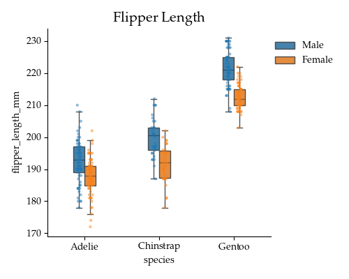

Some helper functions for creating decent plots (based on seaborn)


## Installation

`pip install git+https://github.com/maweigert/betterplots`


### LaTeX

`set_style()` uses LaTeX by default, with NewPX for serif text and mathematics
and Open Sans for sans-serif text. Install a TeX distribution that includes the
`newpx`, `opensans`, `mathtools`, and `bm` packages. Matplotlib may require
additional backend tools such as `dvipng` or Ghostscript.

Use `set_style(usetex=False)` to render without LaTeX. Matplotlib then uses
DejaVu Serif and Open Sans, with DejaVu Sans as the fallback when Open Sans is
not installed.

## Examples


### `boxstripplot`

Provides a boxplot overlayed with a stripplot:


```python
import matplotlib.pyplot as plt
import seaborn as sns
from betterplots import boxstripplot, set_style


set_style()

df = sns.load_dataset("penguins")


plt.figure(figsize=(5, 4))
boxstripplot(data=df, x='species', y='flipper_length_mm', hue='sex', width=.3)
sns.despine()
plt.title('Flipper Length', fontweight="bold")
plt.legend(loc=(1,.8), frameon=False)
plt.tight_layout()
plt.show()


```


