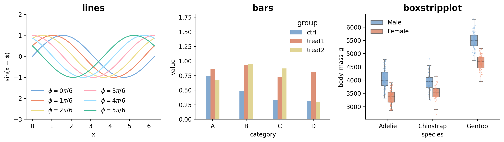
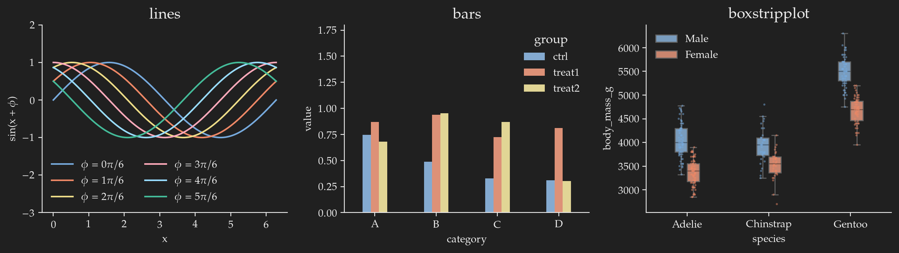
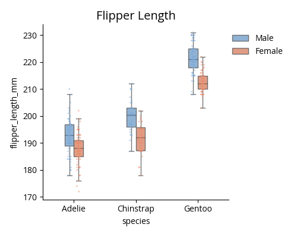

Some helper functions for creating slightly better looking plots (based on seaborn)


```python

import betterplots as bp
bp.set_style()

# use seaborn or maptlotlib to create plots

```




## Installation

`pip install git+https://github.com/maweigert/betterplots`

Requires Python 3.9 or newer. Dependencies, including `tol-colors`, are installed
automatically.

### Styling

Call `set_style()` before creating figures. It uses sans-serif text without
LaTeX, with Open Sans and DejaVu Sans as the fallback. New Matplotlib and Seaborn
plots have white backgrounds, no grid, no top or right spines, and frameless
legends. Explicit plot arguments can override these defaults.

Categorical colors default to `tol_light`. Use `set_style(colors="mw")` for the
custom palette or `set_style(colors="tol_muted")` for Paul Tol's muted palette.
`boxstripplot()` uses the active palette unless an explicit `palette` is passed.
All categorical palettes from `tol-colors` are available with the `tol_` prefix,
including `tol_bright`, `tol_vibrant`, `tol_high_contrast`,
`tol_medium_contrast`, `tol_pale`, `tol_dark`, `tol_light`, and `tol_land_cover`.
Access the color lists through `betterplots.PALETTES` to pass them explicitly
to Seaborn, for example `sns.barplot(..., palette=PALETTES["tol_muted"])`.

Use `set_style(darkmode=True)` for dark backgrounds with light text, ticks,
and spines. Calling `set_style()` again restores the light defaults for new
figures.

Font sizes can be set independently. Pass `rc` for additional Matplotlib
settings, which take precedence over the style defaults:

```python
set_style(
    darkmode=True,
    font_size=14,
    label_size=12,
    tick_size=11,
    legend_font_size=11,
    rc={"font.sans-serif": ["DejaVu Sans"], "lines.linewidth": 2},
)
```

Use `set_style(serif=True)` for DejaVu Serif, or `set_style(usetex=True)` to
enable LaTeX with NewPX for serif text and mathematics and Open Sans for
sans-serif text. Install a TeX distribution that includes the
`newpx`, `opensans`, `mathtools`, and `bm` packages. Matplotlib may require
additional backend tools such as `dvipng` or Ghostscript.

## Examples


### Dark mode with LaTeX

```python
set_style(darkmode=True, usetex=True, serif=True)
```



### `boxstripplot`

Provides a boxplot overlayed with a stripplot:


```python
import matplotlib.pyplot as plt
import seaborn as sns
from betterplots import boxstripplot, set_style


set_style()

df = sns.load_dataset("penguins")


plt.figure(figsize=(5, 4))
boxstripplot(data=df, x='species', y='flipper_length_mm', hue='sex', width=.3)
plt.title('Flipper Length', fontweight="bold")
plt.legend(loc=(1,.8))
plt.tight_layout()
plt.show()


```


