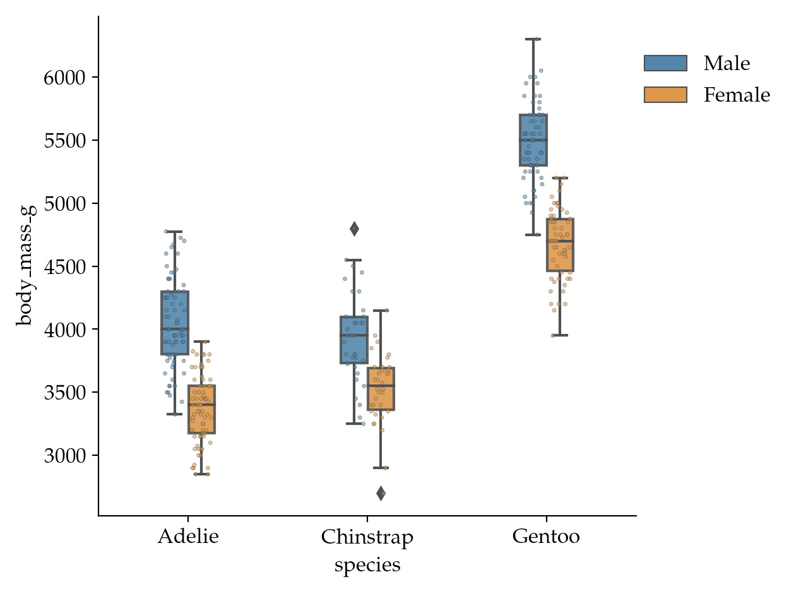

Some helper functions for creating decent plots (based on seaborn)


## Installation 

`pip install git+https://github.com/maweigert/betterplots`

## Examples


### `boxstripplot` 

Provides a boxplot overlayed with a stripplot:


```python 
import matplotlib.pyplot as plt 
import seaborn as sns  
from betterplots import boxstripplot, set_style


set_style() 

df = sns.load_dataset("penguins")


plt.figure()
boxstripplot(data=df, x='species', y='body_mass_g', hue='sex', width=.3)
sns.despine()
plt.legend(loc=(1,.8), frameon=False)
plt.tight_layout()
plt.show()

```



